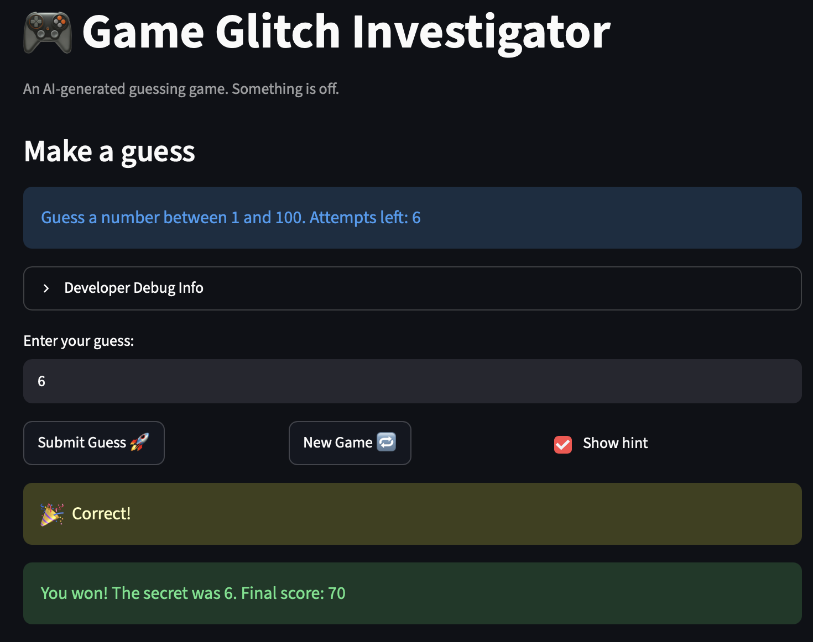

# 🎮 Game Glitch Investigator: The Impossible Guesser

## 🚨 The Situation

You asked an AI to build a simple "Number Guessing Game" using Streamlit.
It wrote the code, ran away, and now the game is unplayable. 

- You can't win.
- The hints lie to you.
- The secret number seems to have commitment issues.

## 🛠️ Setup

1. Install dependencies: `pip install -r requirements.txt`
2. Run the broken app: `python -m streamlit run app.py`

## 🕵️‍♂️ Your Mission

1. **Play the game.** Open the "Developer Debug Info" tab in the app to see the secret number. Try to win.
2. **Find the State Bug.** Why does the secret number change every time you click "Submit"? Ask ChatGPT: *"How do I keep a variable from resetting in Streamlit when I click a button?"*
3. **Fix the Logic.** The hints ("Higher/Lower") are wrong. Fix them.
4. **Refactor & Test.** - Move the logic into `logic_utils.py`.
   - Run `pytest` in your terminal.
   - Keep fixing until all tests pass!

## 📝 Document Your Experience

- [ ] Describe the game's purpose.

The purpose of this game is for the user to guess the correct answer by using as few guesses as possible to have a higher score. According to the difficulty level, the user will have to guess from either a wider range of numbers or a lower number of allowed attempts.

- [ ] Detail which bugs you found.

Bug 1: The hint messages were reversed. For example if the user's guess is too low, the game will tell the user to go even lower instead of going higher.

Bug 2: The code converted the user input into a string and so it could lead the game to give false hint. For example with the case that the code compares "100" and "93", "100" would be considered as smaller than "93" because the single character "1" is smaller than "9".

Bug 3: The difficulty level didn't seem to be actually represented by either the number of attempts allowed or the number range. For instance, the "hard" mode didn't seem much harder than the "normal" mode because the number range was smaller for the "hard" mode, which is supposed to make the game easier.

Bug 4: The game couldn't be restarted by clicking the "New Game" button. When the button is clicked, the game doesn't restart and the user must reload the page or re-run the game from the terminal 


- [ ] Explain what fixes you applied.

## 📸 Demo Walkthrough

Describe your fixed game in numbered steps so a reader can follow along without watching a video:

1. User enters a guess of 50
2. Game returns "Too Low"
3. User enters a guess of 75 -> "Too Low"
4. Score updates correctly after each guess
5. Game ends after the correct guess

**Screenshot** *(optional)*:


## 🧪 Test Results

```
=================================================================== test session starts ====================================================================
platform darwin -- Python 3.13.7, pytest-9.0.3, pluggy-1.6.0 -- /Library/Frameworks/Python.framework/Versions/3.13/bin/python3
cachedir: .pytest_cache
rootdir: /Users/jeremycharlesrafidimanana/Documents/summer 26/codepath/ICAs/ai110-module1show-gameglitchinvestigator-starter
plugins: anyio-4.13.0
collected 10 items                                                                                                                                         

tests/test_game_logic.py::test_winning_guess PASSED                                                                                                  [ 10%]
tests/test_game_logic.py::test_guess_too_high_tells_player_to_go_lower PASSED                                                                        [ 20%]
tests/test_game_logic.py::test_guess_too_low_tells_player_to_go_higher PASSED                                                                        [ 30%]
tests/test_game_logic.py::test_string_secret_is_compared_numerically PASSED                                                                          [ 40%]
tests/test_game_logic.py::test_hard_range_is_not_easier_than_normal PASSED                                                                           [ 50%]
tests/test_game_logic.py::test_parse_guess_accepts_valid_in_range PASSED                                                                             [ 60%]
tests/test_game_logic.py::test_parse_guess_rejects_negative PASSED                                                                                   [ 70%]
tests/test_game_logic.py::test_parse_guess_rejects_decimals_outright PASSED                                                                          [ 80%]
tests/test_game_logic.py::test_parse_guess_rejects_extremely_large_values PASSED                                                                     [ 90%]
tests/test_game_logic.py::test_parse_guess_rejects_non_numbers_and_empty PASSED                                                                      [100%]

==================================================================== 10 passed in 0.01s ====================================================================

```

## 🚀 Stretch Features

- [ ] [If you choose to complete Challenge 4, describe the Enhanced UI changes here — a screenshot is optional]
